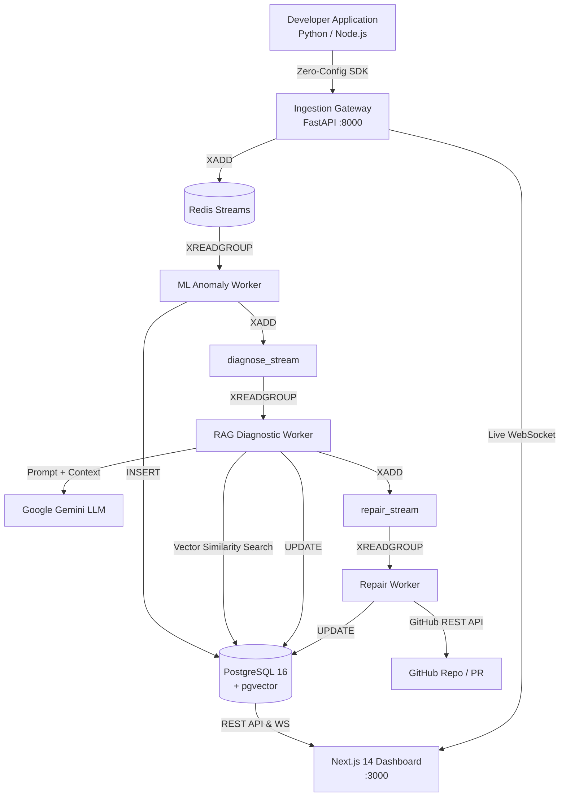
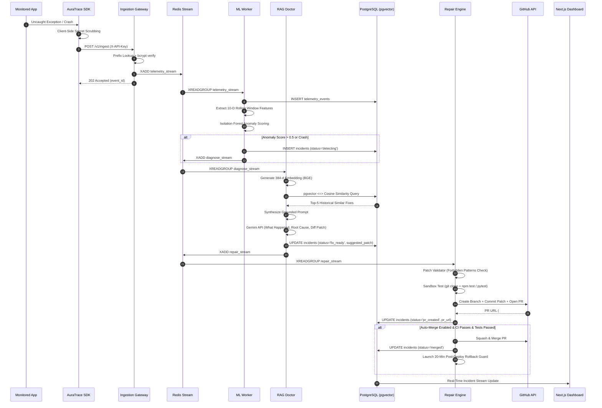
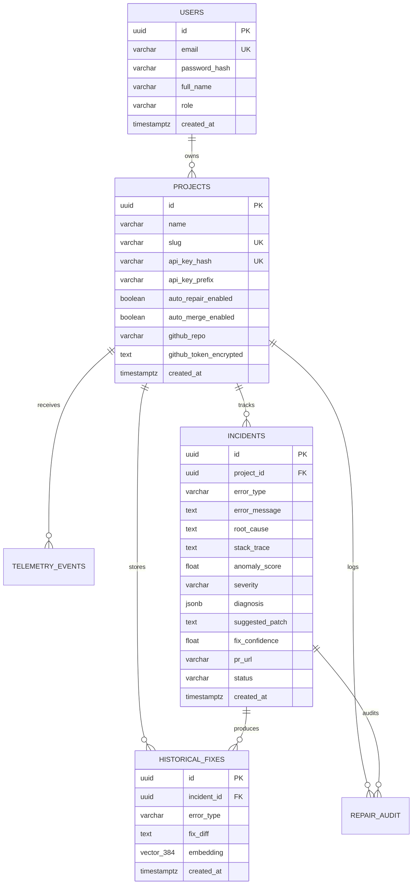

# 🏛️ AuraTrace — System Architecture & Data Flow

## 1. High-Level System Architecture

---

## 2. Sequence Diagram — Autonomous Detection & Auto-Repair

---

## 3. Database Entity Relationship (ER) Diagram

